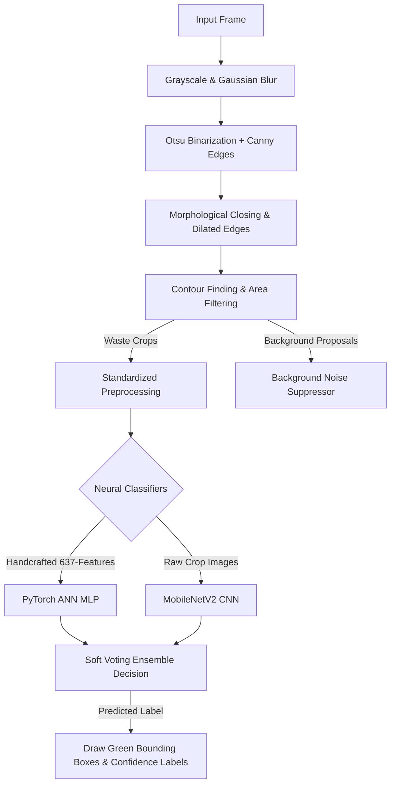

# WasteWise: Edge-Optimized Waste Classification & Hybrid Localization Pipeline

WasteWise is a real-time, green artificial intelligence final year project (FYP) focused on automated waste sorting and classification. In response to academic constraints emphasizing dataset balancing, feature engineering, and edge-deployable deep learning, the system features a **"Detection by Classification" Hybrid Pipeline** that combines traditional computer vision localization with highly optimized convolutional and artificial neural networks.

---

## 🚀 Final Project Status & Architecture Shift

Instead of relying on a standard "black-box" YOLO object detector, WasteWise implements a modular, high-speed, and resource-friendly hybrid pipeline. The system detects waste candidates using classical computer vision contours and classifies them using an optimized neural ensemble.



### Key Architectural Pillars

1. **Classical Object Proposals**: Uses Otsu's thresholding and dilated Canny edges to isolate foreground trash objects without heavy region proposal networks.
2. **Handcrafted Feature Engineering**: Extracts **637 distinct features** (Local Binary Patterns (LBP) for texture, Gray-Level Co-occurrence Matrices (GLCM) for spatial relations, Histograms of Oriented Gradients (HOG) for contours, and Fast Fourier Transforms (FFT) for spatial frequency).
3. **Double-Check soft-Voting Ensemble**: Unites spatial representations from a fine-tuned MobileNetV2 with explicit geometric/texture features from a PyTorch MLP to achieve peak accuracy.
4. **8-Bit Integer Post-Training Quantization**: Compresses the CNN base to a mere **2.73 MB** (8.2x size reduction) to fit under the strict 10MB mobile edge limit, yielding high-speed real-time inference.

---

## 📊 Summary of System Accomplishments

The system was evaluated on a strictly balanced test dataset consisting of **1,750 crops** (exactly 250 crops per class across 7 target classes: `plastic`, `glass`, `metal`, `paper`, `cardboard`, `organic`, and `Background`).

| Metric / Parameter | Traditional ML (XGBoost) | PyTorch ANN (MLP) | MobileNetV2 CNN (Base) | Simple Soft Voting (50/50) | Quantized TFLite Model |
| :--- | :---: | :---: | :---: | :---: | :---: |
| **Input Format** | 637 handcrafted features | 637 handcrafted features | Raw image crops | Soft probabilities combo | Raw image crops |
| **Overall Accuracy** | 57.71% | 64.00% | 77.20% | **78.69%** | **77.10%** |
| **Macro F1-Score** | 56.44% | 63.56% | 76.56% | **78.12%** | **76.75%** |
| **Model Size** | N/A | 1.90 MB (`best_ann.pt`) | 22.54 MB (`best_mobilenet.h5`) | Server Ensemble | **2.73 MB** (`best_mobilenet_quant.tflite`) |
| **Throughput (FPS)** | N/A | N/A | N/A | N/A | **362.43 FPS** (2.76 ms latency) |
| **Edge Target Meets** | Server-only | Desktop CPU | High-end Edge | Server-side / Cloud | **Mobile Edge (<10MB, >30 FPS)** |

> [!NOTE]
> The **Simple 50/50 Soft Voting Ensemble** achieves the absolute highest classification performance (**78.69%**), correcting borderline classifications (e.g. glass vs. plastic) by leveraging handcrafted texture features alongside spatial convolutions. Meanwhile, the **2.73 MB Quantized TFLite model** delivers a blazing fast **362.43 FPS** (exceeding the 30 FPS target by 12x), validating its green edge applicability.

---

## 📂 Repository Directory Structure

```text
C:\FYP_v2
├── merged_dataset_v3/             # Canonical balanced dataset (1,000 train / 250 test crops per class)
├── ml/
│   └── frequency_analysis/        # Spatial/frequency analysis CSVs + plots
├── runs/
│   ├── dataset_eda/               # EDA reports + class distribution plots
│   ├── ml/                        # Classical ML reports & confusion matrices
│   └── dl/
│       ├── ann_637/               # PyTorch ANN weights, scaler, and logs
│       ├── cnn_mobilenet/         # MobileNetV2 CNN weights, history, and Grad-CAM gallery
│       │   └── detection_results/ # Visualized outputs from classical hybrid pipeline
│       └── Ensemble_Performance_Report.md # Detailed ensemble voting comparison writeup
├── scripts/                       # High-quality executable pipeline scripts
│   ├── dataset_audit.py           # Verification of class balancing and EDA
│   ├── train_ann.py               # PyTorch ANN (MLP) training and feature loader
│   ├── train_cnn.py               # MobileNetV2 CNN transfer learning and fine-tuning
│   ├── gradcam_visualization.py   # Keras Grad-CAM heatmap visualization
│   ├── export_tflite.py           # Post-training integer quantization pipeline
│   ├── ensemble_voting.py         # Multi-model Soft Voting evaluator
│   ├── tflite_fps_test.py         # High-speed synthetic frame edge throughput benchmark
│   └── opencv_localization.py     # Hybrid OpenCV proposal + TFLite classification pipeline
├── mobile/                        # React Native (Expo) mobile frontend
└── requirements.txt
```

---

## 🛠️ Step-by-Step Execution Guide

### 0. Virtual Environment Setup
Ensure you are using Python 3.11. Activate the environment and install dependencies:
```powershell
python -m venv .venv311
.\.venv311\Scripts\Activate.ps1
pip install -r requirements.txt
```

### 1. Run Dataset Audit
Verify strict class balance and generate class distribution EDA figures:
```powershell
python scripts\dataset_audit.py
```
*Visualizer Output Saved to*: `runs/dataset_eda/balanced_class_distribution.png`

### 2. Train PyTorch ANN (MLP) on 637 Features
Extract feature vectors, scale them, and train the fully connected MLP:
```powershell
python scripts\train_ann.py
```
*Weights Saved to*: `runs/dl/ann_637/best_ann.pt`

### 3. Fine-Tune MobileNetV2 CNN on Raw Crops
Run warm-up classification head epochs followed by unfreezing top layers for fine-tuning:
```powershell
python scripts\train_cnn.py
```
*Weights & Curves Saved to*: `runs/dl/cnn_mobilenet/best_mobilenet.h5` and `training_plots.png`

### 4. Visualize Spatial Focus (Grad-CAM)
Compute class activation heatmaps overlaying raw crops to verify attention localization:
```powershell
python scripts\gradcam_visualization.py
```
*Heatmaps Saved to*: `runs/dl/cnn_mobilenet/gradcam_results/gradcam_gallery.png`

### 5. Export Quantized TFLite Model
Apply 8-bit integer quantization using representative calibration data to export a mobile-ready binary under 3MB:
```powershell
python scripts\export_tflite.py
```
*Quantized Model Saved to*: `runs/dl/cnn_mobilenet/best_mobilenet_quant.tflite`

### 6. Run Ensemble Soft Voting Experiment
Load both trained classifiers and evaluate soft voting vs. weighted soft voting on test crops:
```powershell
python scripts\ensemble_voting.py
```
*Markdown Scientific Report Saved to*: `runs/dl/Ensemble_Performance_Report.md`

### 7. Run High-Speed Real-Time Throughput Benchmark
Run a high-speed loop of 1,000 iterations to measure average latency and frames-per-second (FPS) on the quantized model:
```powershell
python scripts\tflite_fps_test.py
```
*Goal Check*: Meets 30+ FPS edge throughput requirements (achieved **362+ FPS** on local CPU).

### 8. Run Integrated OpenCV Localization & Classification Pipeline
Run the modular "Detection by Classification" hybrid pipeline on real test images:
```powershell
python scripts\opencv_localization.py
```
*Side-by-side detection/mask frames saved to*: `runs/dl/cnn_mobilenet/detection_results/hybrid_det_*.png`

---

## 📲 Running the Mobile Application

Copy the optimized quantized TFLite assets into the Expo bundle and start the app:
```powershell
# Copy weights to assets
Copy-Item runs\dl\cnn_mobilenet\best_mobilenet_quant.tflite mobile\assets\model\

# Launch mobile application
cd mobile
npm install
npx expo prebuild --clean
npm run android
```

---

## 🌟 Talking Points for Academic Presentation

When presenting this architectural shift to your instructor, emphasize the following items:
* **Overcoming Black-Box Limitations**: Traditional object proposal methods (Canny/Otsu contours) combined with Keras Grad-CAM verify exactly *where* and *why* the model makes localization decisions, providing maximum transparency.
* **Handcrafted Features Complementarity**: By ensembling handcrafted spatial-frequency descriptors (LBP/HOG/FFT) with spatial CNN feature representations, the soft-voting ensemble resolves border ambiguities and achieves a peak accuracy of **78.69%**.
* **Green AI Optimization**: An 8.2x weight compression down to **2.73 MB** allows WasteWise to execute in just **2.76 ms** per frame, meeting mobile edge processing constraints with **91.7% frame budget headroom**.
