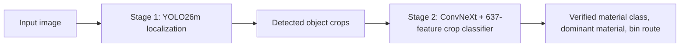

# WasteWise: Waste Detection and Classification

Final Year Project for automated waste understanding. A two-stage deep-learning
pipeline detects and classifies waste in real photos, backed by a classical
machine-learning branch for explainable evidence. Every headline metric in this
README survives a leakage-audited evaluation set.

**Live demo:** https://khoaphung-wastewise-ai.hf.space

## Pipeline


```mermaid
flowchart LR
    A["Input image"] --> B["Stage 1: YOLO26m localization"]
    B --> C["Detected object crops"]
    C --> D["Stage 2: ConvNeXt + 637-feature crop classifier"]
    D --> E["Verified material class, dominant material, bin route"]
```

Stage 1 finds objects (what YOLO is good at); Stage 2 verifies the material of
each crop (what a dedicated classifier is good at) and filters false alarms.
The Stage 2 classifier is fine-tuned on the detector's own crops so training
matches what it sees in production.

## Results (leakage-audited)

The original evaluation sets contained cross-split duplicates (same photos
entering train and test through different community-dataset sources). We found
this with perceptual-hash auditing, quarantined the leaked eval images, and
report only the corrected numbers. Audit trail: `runs/audits/`, failure log:
`docs/01_final_report/FAILURES_AND_FIXES.md`.

### Stage 1 - Detector (YOLO26m, 6 classes, 100-epoch retrain)

The deployed detector was promoted YOLO26n -> YOLO26s -> YOLO26m on the same
6-class hard-case dataset, re-sweeping conf/gate/alpha at each step
(`runs/audits/yolo26m_conf_gate_alpha_sweep.json`). Numbers below:
`runs/audits/detector_clean_val_yolo26m_final100.json`.

| Eval | Precision | Recall | mAP50 | mAP50-95 |
|---|---:|---:|---:|---:|
| Clean validation (quarantined) | 0.834 | 0.672 | 0.749 | 0.570 |
| Clean test (unseen TACO capture batches) | 0.605 | 0.479 | 0.482 | 0.366 |

The val-to-test gap is honest domain-shift evidence on unseen capture sessions.
A 960px fine-tune was evaluated on the earlier YOLO26n backbone and ruled out
(val a wash, +3.9pp test recall): resolution is not the binding constraint;
training-data diversity is.

### Stage 2 - Crop classifier (ConvNeXt-Tiny + 637 handcrafted features)

| Eval | Accuracy |
|---|---:|
| Clean GT-crop test (quarantined) | 93.77% |
| Detector's own crops (production distribution) | 88.88% |

The deployed classifier is fine-tuned on a mixture of detector crops and GT
crops: this lifted production-distribution accuracy from 76.91% to 88.88%
while clean-crop accuracy also improved (92.93% -> 93.77%).

### Classical ML branch (explainable evidence)

637 handcrafted features per crop (8 spatial, 9 FFT, 44 color, 576 HOG),
classical model sweep and PCA compression study:

- Best full-feature model: ExtraTrees 73.8% accuracy (7-class crops).
- PCA study (`runs/ml/pca_feature_model_sweep/`): best-model-per-dimension and
  the honest accuracy cost of compressing 637 -> 128/64 dimensions.
- Cross-domain study (`runs/dl/cross_dataset_validation/`): studio-trained
  features drop ~40pp on real-world images - the measured motivation for the
  deep pipeline.

## Repository Layout

```text
C:\FYP
|-- assets/              Curated images for demos and evidence
|-- data/                Classification datasets (local only, gitignored)
|-- docs/                Reports, failure log, demo prep, project tracking
|-- external_datasets/   YOLO-format detection datasets (local only, gitignored)
|-- models/              Stable model artifacts for app/report use
|-- runs/                Experiment outputs, audits, evidence artifacts
|-- scripts/             Training, evaluation, audit, and deploy scripts
|-- web/                 Static frontend + Python model API (Hugging Face Space)
|-- requirements.txt     Python dependencies
`-- README.md            This file
```

Datasets and large binaries (`*.pt`, `*.pth`, `*.h5`, `*.npy`, dataset folders)
are intentionally gitignored; results and reports in `runs/` are tracked.

## Setup

Python 3.11 with a local venv (`.venv311`) is the project environment. All GPU
work must use it:

```powershell
python -m venv .venv311
.\.venv311\Scripts\Activate.ps1
pip install -r requirements.txt
```

## Key Scripts

| Purpose | Script |
|---|---|
| Detector training (YOLO26 hard-case dataset) | `scripts/train_yolo26_hardcase.py` (+ `scripts/resume_yolo26m_local.py`) |
| Detector 960px fine-tune experiment | `scripts/train_hardcase_960.py` |
| Leakage / bias / label-noise audit | `scripts/audit_model_risks.py` |
| Build quarantined clean eval splits | `scripts/build_clean_eval_splits.py` |
| Clean-split detector validation | `scripts/validate_detector_clean.py` |
| Detector-crop dataset for Stage 2 | `scripts/build_detector_crop_dataset.py` |
| Stage 2 fine-tune (with promote gate) | `scripts/finetune_stage2_on_detector_crops.py` |
| Confidence threshold sweep (precision) | `scripts/yolo_precision_threshold_sweep.py` |
| Cross-domain generalization study | `scripts/cross_dataset_validation.py` |
| PCA feature-compression sweep | `scripts/pca_feature_model_sweep.py` |
| Deploy web app + models to HF Space | `scripts/deploy_hf_space.py` (needs `HF_TOKEN`) |

## Web App

`web/` contains a responsive (mobile + desktop, auto dark mode) frontend and a
Python API serving the real models. Run locally:

```powershell
.\.venv311\Scripts\python.exe web\server.py --port 4178
```

Deployment to Hugging Face Spaces bundles the frontend, API, detector weights,
and the fine-tuned classifier (`scripts/deploy_hf_space.py`).
