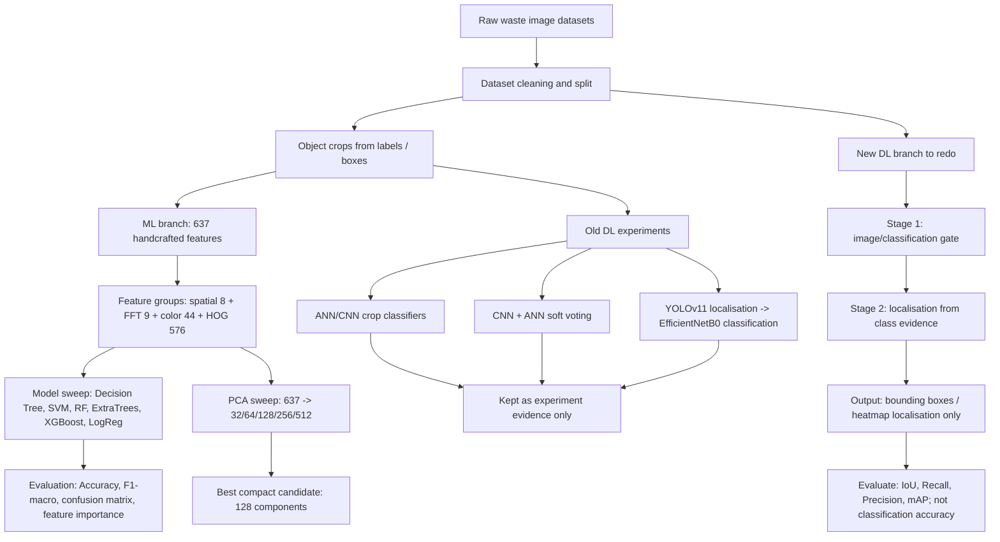
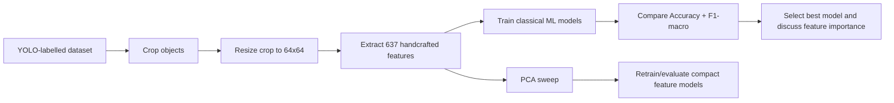
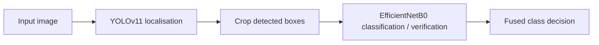
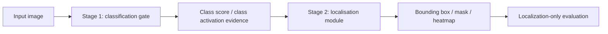

# Workflow, Approaches, And Current Decision

Ngay hien tai nen trinh bay project theo 2 nhanh rieng:

- **Current/newest dataset tracking:** use `external_datasets/super_yolo_dataset` for YOLO localization evidence and `data/merged_dataset_v5` for classification evidence.
- **ML pipeline: giu lai** vi da co feature engineering ro rang, PCA sweep, model comparison, va ket qua co the giai thich.
- **Deep Learning pipeline: lam lai** theo huong moi: Stage 1 classification -> Stage 2 localisation. Nhanh DL moi chi danh gia localization, khong dung pipeline YOLO-localize-truoc/CNN-classify-sau lam ket qua chinh.

## 1. Overall Workflow



## 2. Approaches Already Completed

| Approach | What was done | Result / Evidence | Decision |
|---|---|---:|---|
| Newest YOLO dataset | Current YOLO-format localization dataset. | `external_datasets/super_yolo_dataset`: 23,929 images, 102,777 boxes across 6 classes. | Use as current localization dataset. |
| Newest classification dataset | Current class-folder classification dataset. | `data/merged_dataset_v5`: 29,639 images across 7 classes including Background. | Use as current classification dataset. |
| Legacy dataset merge + EDA | Earlier YOLO-style evidence used by saved lecturer ML artifacts. | `merged_dataset_v3` has 114,220 boxes total; balanced ML cap is 4,000 train crops per class. | Keep only as historical/saved-result context unless rerun. |
| Classical ML with 637 features | Extracted handcrafted crop features: 8 spatial, 9 FFT/frequency, 44 color, 576 HOG. | Best lecturer run: XGBoost accuracy `0.6742`, F1-macro `0.6506` in `runs/ml/feature_ml_lecturer_6class_4k/REPORT.md`. | Main ML evidence, but label as legacy if not rerun on newest dataset. |
| ML model comparison | Compared Decision Tree, Linear SVM, RF, ExtraTrees, XGBoost, LogReg where available. | XGBoost is best in lecturer run; ExtraTrees is best in ML-vs-DL comparison subset with accuracy `0.6312`, F1 `0.6113`. | Present both with source path. |
| PCA dimensionality sweep | Reduced 637-D handcrafted feature space to 32/64/128/256/512 components and retrained MLP. | 128 PCA components keep `99.90%` explained variance; saved report shows accuracy `73.24% -> 68.71%`, latency `0.0533 ms -> 0.0314 ms`. | Good compact-feature experiment; rerun if final claim must be exactly ~2% drop. |
| ANN/CNN crop baselines | Trained lightweight DL classifiers on object crops. | ANN/CNN baselines are weaker than ML in final report: e.g. tuned ANN `0.4057`, tuned CNN `0.4413`. | Use as baseline only. |
| CNN/ANN ensemble | Combined CNN raw-crop features with ANN handcrafted features by soft voting. | Simple 50/50 ensemble accuracy `78.69%`, macro F1 `78.12%`; CNN baseline `77.20%`, ANN `64.00%`. | Evidence of feature complementarity, not final DL direction. |
| DL architecture comparison | Compared MobileNetV2, ResNet50, EfficientNetB0 for crop classification. | EfficientNetB0 accuracy `94.29%`, size `29.21 MB`; MobileNetV2 `85.43%`; ResNet50 `89.76%`. | Classification evidence only. |
| Old 2-stage DL pipeline | YOLOv11 first localizes boxes, EfficientNetB0 then verifies/classifies crops. | 100-image sweep: 348 YOLO proposals, 295 accepted, 238.08 ms/image, 4.20 FPS. | Do not use as final workflow because new requirement reverses stage order. |

## 3. ML Pipeline To Keep



Feature vector:

| Feature group | Count | Purpose |
|---|---:|---|
| Spatial | 8 | Intensity, gradients, edge density |
| Frequency / FFT | 9 | Radial frequency energy and high-frequency texture |
| Color | 44 | HSV histograms plus BGR/HSV mean/std |
| HOG | 576 | Local shape and gradient-orientation texture |
| **Total** | **637** | Fixed lecturer-explainable handcrafted representation |

Main model table from `runs/ml/feature_ml_lecturer_6class_4k/REPORT.md`:

| Model | Accuracy | F1-macro |
|---|---:|---:|
| XGBoost | 0.6742 | 0.6506 |
| ExtraTrees | 0.6312 | 0.6113 |
| Random Forest | 0.6317 | 0.6111 |
| Linear SVM | 0.5960 | 0.5642 |
| Logistic Regression | 0.5864 | 0.5558 |
| Decision Tree | 0.5115 | 0.4883 |

PCA table from `runs/dl/pca_experiments/PCA_Dimensionality_Report.md`:

| Components | Explained variance | Accuracy | Weighted F1 | Latency |
|---:|---:|---:|---:|---:|
| 637 | 100.00% | 73.24% | 0.7319 | 0.0533 ms |
| 64 | 99.78% | 67.48% | 0.6736 | 0.0284 ms |
| 128 | 99.90% | 68.71% | 0.6863 | 0.0314 ms |
| 256 | 99.97% | 66.95% | 0.6691 | 0.0296 ms |

Presentation note: if the thesis/slide says "PCA 637 -> 128 only drops about 2%", the PCA artifact must be rerun or replaced with the matching final run. The current saved artifact shows a `4.53` percentage-point drop from `73.24%` to `68.71%`.

## 4. Deep Learning Pipeline To Redo

Old DL workflow:



New required DL workflow:



Recommended implementation:

1. Train or reuse an image-level classifier as Stage 1.
2. Run Stage 1 first and record the predicted image-level class/gate result.
3. Run Stage 2 as a localization-only module. Two modes are implemented:
   - `gradcam`: weakly-supervised classifier evidence -> heatmap -> boxes.
   - `yolo`: classifier first, then YOLO used only for bounding-box localization.
4. Evaluate only localization metrics against YOLO labels: IoU@0.5, Recall, Precision, mAP-style AP if enough detections are produced.
5. Report classification only as an internal gate, not the final DL result.

Implemented runnable script:

```powershell
.\.venv311\Scripts\python.exe scripts\classification_to_localization_pipeline.py `
  --max-images 60 `
  --max-visuals 18 `
  --sample-mode stratified `
  --seed 42 `
  --localizer yolo `
  --yolo-conf 0.35 `
  --out-dir runs\dl\localization_rework\yolo_conf035_stratified60_final
```

Stage 2 improvement result:

| Stage 2 localizer | Precision | Recall | Mean matched IoU | TP | FP | FN |
|---|---:|---:|---:|---:|---:|---:|
| Grad-CAM baseline | 0.2568 | 0.0728 | 0.7127 | 19 | 55 | 242 |
| YOLO localization-only, conf=0.25 | 0.6352 | 0.5670 | 0.9012 | 148 | 85 | 113 |
| YOLO localization-only, conf=0.35 | 0.7614 | 0.5134 | 0.9004 | 134 | 42 | 127 |

Recommended setting: `--localizer yolo --yolo-conf 0.35`, because it gives the best precision/F1 balance among the quick checks while keeping IoU high.

Artifacts:

- `scripts/classification_to_localization_pipeline.py`
- `runs/dl/localization_rework/gradcam_baseline_stratified60/REPORT.md` (Grad-CAM baseline)
- `runs/dl/localization_rework/yolo_conf025_stratified60/REPORT.md` (YOLO conf=0.25)
- `runs/dl/localization_rework/yolo_conf035_stratified60_final/REPORT.md` (YOLO conf=0.35)
- each output folder includes `predictions.csv`, `summary.json`, and `visuals/*.jpg`

Interpretation: the classifier-first Grad-CAM path is runnable but weak for multi-object localization. The improved Stage 2 uses the existing YOLO model as a localization-only module after the classifier gate, reversing the old YOLO-first flow and removing YOLO's role as the final class decision.

Why this fits the new direction:

- Stage 1 is classification, so the model first answers "what visual evidence is present?"
- Stage 2 is localisation, so the final DL task becomes "where is the object evidence?"
- The final output can be a box/heatmap without claiming crop classification as the DL contribution.

## 5. Final Report Positioning

Use this wording:

> The ML pipeline is finalized with 637 handcrafted features, classical model comparison, and PCA dimensionality reduction. The best lecturer-facing ML result is XGBoost with accuracy 0.6742 and F1-macro 0.6506. PCA shows that the feature space can be compressed to 128 dimensions while preserving 99.90% variance, with a measured accuracy trade-off that must be reported from the final saved run.
>
> The previous deep-learning work is treated as experimental evidence. The final DL pipeline is redesigned as a classification-to-localisation workflow: Stage 1 performs image-level classification/gating, and Stage 2 performs localization only. In the improved run, YOLO is used only as the Stage 2 box localizer, not as the final classifier. The DL branch is therefore evaluated using localization metrics only.
