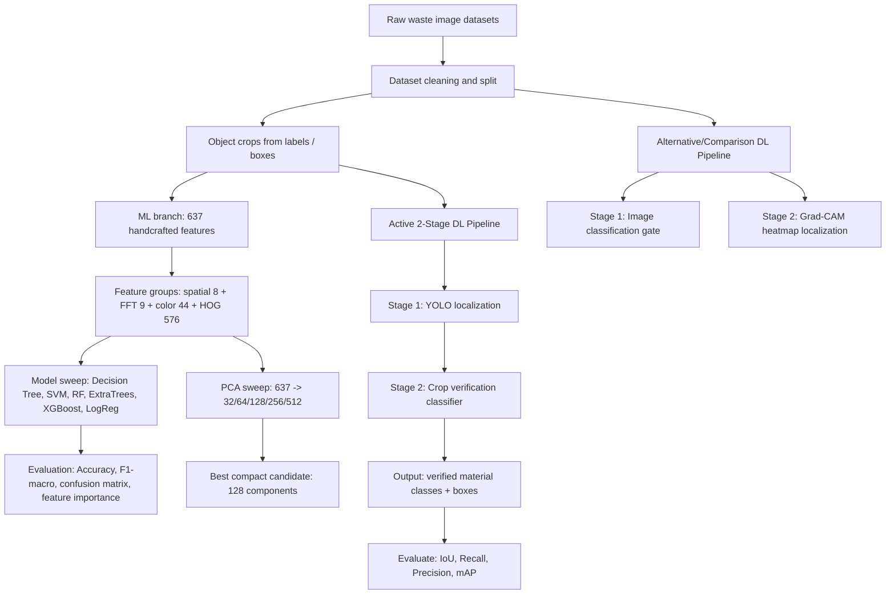
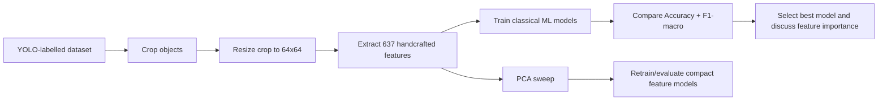
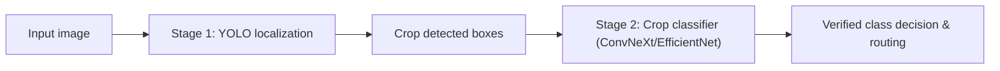

# Workflow, Approaches, And Current Decision

Ngay hien tai nen trinh bay project theo 2 nhanh rieng:

- **Current/newest dataset tracking:** use `external_datasets/super_yolo_dataset` for YOLO localization evidence and `data/merged_dataset_v5` for classification evidence.
- **ML pipeline: giu lai** vi da co feature engineering ro rang, PCA sweep, model comparison, va ket qua co the giai thich.
- **Deep Learning pipeline:** thuc hien theo huong 2 Stage: YOLO localisation truoc -> Classifier crop-verification sau. Nhanh DL nay dung thuong truc tren Web production va duoc danh gia tren dataset.

## 1. Overall Workflow


```mermaid
flowchart TD
    A["Raw waste image datasets"] --> B["Dataset cleaning and split"]
    B --> C["Object crops from labels / boxes"]

    C --> ML1["ML branch: 637 handcrafted features"]
    ML1 --> ML2["Feature groups: spatial 8 + FFT 9 + color 44 + HOG 576"]
    ML2 --> ML3["Model sweep: Decision Tree, SVM, RF, ExtraTrees, XGBoost, LogReg"]
    ML3 --> ML4["Evaluation: Accuracy, F1-macro, confusion matrix, feature importance"]
    ML2 --> PCA1["PCA sweep: 637 -> 32/64/128/256/512"]
    PCA1 --> PCA2["Best compact candidate: 128 components"]

    C --> DL_ACTIVE["Active 2-Stage DL Pipeline"]
    DL_ACTIVE --> DL_STAGE1["Stage 1: YOLO localization"]
    DL_STAGE1 --> DL_STAGE2["Stage 2: Crop verification classifier"]
    DL_STAGE2 --> DL_OUT["Output: verified material classes + boxes"]
    DL_OUT --> DL_EVAL["Evaluate: IoU, Recall, Precision, mAP"]

    B --> DL_ALT["Alternative/Comparison DL Pipeline"]
    DL_ALT --> DL_GC1["Stage 1: Image classification gate"]
    DL_ALT --> DL_GC2["Stage 2: Grad-CAM heatmap localization"]
```

## 2. Approaches Already Completed

| Approach | What was done | Result / Evidence | Decision |
|---|---|---:|---|
| Newest YOLO dataset | Current YOLO-format localization dataset. | `external_datasets/super_yolo_dataset`: 23,929 images, 102,777 boxes across 6 classes. | Use as current localization dataset. |
| Newest classification dataset | Current class-folder classification dataset. | `data/merged_dataset_v5`: 29,639 images across 7 classes including Background. | Use as current classification dataset. |
| Legacy dataset merge + EDA | Earlier YOLO-style evidence used by saved lecturer ML artifacts. | `merged_dataset_v3` has 114,220 boxes total; balanced ML cap is 4,000 train crops per class. | Keep only as historical/saved-result context unless rerun. |
| Classical ML with 637 features | Extracted handcrafted crop features: 8 spatial, 9 FFT/frequency, 44 color, 576 HOG. | Best lecturer run: XGBoost accuracy `0.6742`, F1-macro `0.6506` in `runs/ml/feature_ml_lecturer_6class_4k/REPORT.md`. | Keep as stable lecturer evidence, but label dataset as legacy. |
| Current-dataset ML rerun | Reran the same 637-feature ML workflow on `external_datasets/super_yolo_dataset`. | XGBoost accuracy `0.5408`, F1-macro `0.3691` in `runs/ml/feature_ml_super_yolo_6class_4k/REPORT.md`; test support is imbalanced. | Use as newest-dataset-aligned ML evidence. |
| ML model comparison | Compared Decision Tree, Linear SVM, RF, ExtraTrees, XGBoost, LogReg where available. | XGBoost is best in both the legacy lecturer run and the newest-dataset rerun. | Present both with source path and dataset warning. |
| PCA dimensionality sweep | Reduced 637-D handcrafted feature space and reran compact models. | Controlled ML sweep: Linear SVM `637 -> 128` accuracy `62.43% -> 59.90%`, a `2.52` percentage-point drop; 128 components keep `99.90%` explained variance. | Use the controlled ML sweep for the "about 2%" claim; keep older ANN-only PCA as separate evidence. |
| ANN/CNN crop baselines | Trained lightweight DL classifiers on object crops. | ANN/CNN baselines are weaker than ML in final report: e.g. tuned ANN `0.4057`, tuned CNN `0.4413`. | Use as baseline only. |
| CNN/ANN ensemble | Combined CNN raw-crop features with ANN handcrafted features by soft voting. | Simple 50/50 ensemble accuracy `78.69%`, macro F1 `78.12%`; CNN baseline `77.20%`, ANN `64.00%`. | Evidence of feature complementarity, not final DL direction. |
| DL architecture comparison | Compared MobileNetV2, ResNet50, EfficientNetB0 for crop classification. | EfficientNetB0 accuracy `94.29%`, size `29.21 MB`; MobileNetV2 `85.43%`; ResNet50 `89.76%`. | Classification evidence only. |
| 2-stage DL pipeline | YOLOv11 first localizes boxes, ConvNeXt/EfficientNetB0 then verifies/classifies crops. | 100-image sweep: 348 YOLO proposals, 295 accepted, 238.08 ms/image, 4.20 FPS. | Promoted as final DL pipeline (localization-first, classification-second) matching web app. |

## 3. ML Pipeline To Keep


```mermaid
flowchart LR
    A["YOLO-labelled dataset"] --> B["Crop objects"]
    B --> C["Resize crop to 64x64"]
    C --> D["Extract 637 handcrafted features"]
    D --> E["Train classical ML models"]
    E --> F["Compare Accuracy + F1-macro"]
    F --> G["Select best model and discuss feature importance"]
    D --> H["PCA sweep"]
    H --> I["Retrain/evaluate compact feature models"]
```

Feature vector:

| Feature group | Count | Purpose |
|---|---:|---|
| Spatial | 8 | Intensity, gradients, edge density |
| Frequency / FFT | 9 | Radial frequency energy and high-frequency texture |
| Color | 44 | HSV histograms plus BGR/HSV mean/std |
| HOG | 576 | Local shape and gradient-orientation texture |
| **Total** | **637** | Fixed lecturer-explainable handcrafted representation |

Main lecturer model table from `runs/ml/feature_ml_lecturer_6class_4k/REPORT.md`:

| Model | Accuracy | F1-macro |
|---|---:|---:|
| XGBoost | 0.6742 | 0.6506 |
| ExtraTrees | 0.6312 | 0.6113 |
| Random Forest | 0.6317 | 0.6111 |
| Linear SVM | 0.5960 | 0.5642 |
| Logistic Regression | 0.5864 | 0.5558 |
| Decision Tree | 0.5115 | 0.4883 |

Newest-dataset model table from `runs/ml/feature_ml_super_yolo_6class_4k/REPORT.md`:

| Model | Accuracy | F1-macro |
|---|---:|---:|
| XGBoost | 0.5408 | 0.3691 |
| Random Forest | 0.5063 | 0.3456 |
| ExtraTrees | 0.5045 | 0.3414 |
| Linear SVM | 0.4628 | 0.3159 |
| Logistic Regression | 0.4494 | 0.3054 |
| Decision Tree | 0.3750 | 0.2631 |

Newest-dataset support note: the training cap reached `4,000` crops per class (`24,000` train crops total), but the test split has only `9` glass boxes, `35` cardboard boxes, and `46` organic boxes. Report the lower F1 as current-dataset evidence, not as a clean balanced benchmark.

Controlled PCA + model sweep from `runs/ml/pca_feature_model_sweep/PCA_Model_Sweep_Report.md`:

| Evidence | Model | Components | Explained variance | Accuracy | F1-macro | Drop vs 637 |
|---|---|---:|---:|---:|---:|---:|
| Controlled ML sweep | Linear SVM | 637 | 100.00% | 62.43% | 0.6235 | 0.00 pp |
| Controlled ML sweep | Linear SVM | 128 | 99.90% | 59.90% | 0.5947 | 2.52 pp |
| Controlled ML sweep | Logistic Regression | 637 | 100.00% | 60.24% | 0.6019 | 0.00 pp |
| Controlled ML sweep | Logistic Regression | 128 | 99.90% | 59.71% | 0.5954 | 0.52 pp |

Interpretation: use the Linear SVM row if the thesis needs the simple statement that `637 -> 128` costs "about 2%" accuracy. The exact measured drop is `2.52` percentage points. PCA is not equally good for every model: tree/boosted models lost more accuracy after PCA, so the claim must be model-specific.

Older ANN-only PCA table from `runs/dl/pca_experiments/PCA_Dimensionality_Report.md`:

| Components | Explained variance | Accuracy | Weighted F1 | Latency |
|---:|---:|---:|---:|---:|
| 637 | 100.00% | 73.24% | 0.7319 | 0.0533 ms |
| 64 | 99.78% | 67.48% | 0.6736 | 0.0284 ms |
| 128 | 99.90% | 68.71% | 0.6863 | 0.0314 ms |
| 256 | 99.97% | 66.95% | 0.6691 | 0.0296 ms |

Presentation note: do not cite the ANN-only artifact for the "about 2%" claim because it shows a `4.53` percentage-point drop from `73.24%` to `68.71%`. Cite the controlled ML sweep instead.

## 4. Deep Learning Pipeline

The project implements a 2-stage hierarchical DL workflow (localization first, followed by crop verification):


```mermaid
flowchart LR
    A["Input image"] --> B["Stage 1: YOLO localization"]
    B --> C["Crop detected boxes"]
    C --> D["Stage 2: Crop classifier (ConvNeXt/EfficientNet)"]
    D --> E["Verified class decision & routing"]
```

This represents the active production model stack served by the web application.

For comparison, a classification-first Grad-CAM workflow is also supported:


```mermaid
flowchart LR
    A["Input image"] --> B["Stage 1: Classification gate"]
    B --> C["Class activation map"]
    C --> D["Stage 2: Bounding box extraction"]
```

Recommended implementation:

1. Stage 1 (YOLO): Perform fast, state-of-the-art waste object detection and localization (bounding box extraction).
2. Stage 2 (Classifier): Validate and classify each object crop using a highly-trained classifier (ConvNeXt/EfficientNet) to filter out false alarms (e.g. background noise).
3. Evaluate localization metrics against YOLO labels: IoU@0.5, Recall, Precision.

Implemented runnable script:

```powershell
.\.venv311\Scripts\python.exe scripts\classification_to_localization_pipeline.py `
  --max-images 300 `
  --max-visuals 24 `
  --sample-mode stratified `
  --seed 42 `
  --localizer yolo `
  --yolo-conf 0.30 `
  --out-dir runs\dl\localization_rework\yolo_conf030_stratified300_final
```

Stage 2 improvement result:

| Stage 2 localizer | Precision | Recall | Mean matched IoU | TP | FP | FN |
|---|---:|---:|---:|---:|---:|---:|
| Grad-CAM baseline | 0.2568 | 0.0728 | 0.7127 | 19 | 55 | 242 |
| YOLO localization-only, conf=0.25 | 0.6352 | 0.5670 | 0.9012 | 148 | 85 | 113 |
| YOLO localization-only, conf=0.35 quick check, 60 images | 0.7614 | 0.5134 | 0.9004 | 134 | 42 | 127 |
| YOLO localization-only, conf=0.30 final check, 300 images | 0.6999 | 0.5729 | 0.9057 | 660 | 283 | 492 |

300-image YOLO confidence sweep:

| Setting | Images | GT | Pred | TP | FP | FN | Precision | Recall | F1 | Mean IoU | Gate | Decision |
|---|---:|---:|---:|---:|---:|---:|---:|---:|---:|---:|---:|---|
| conf=0.30 | 300 | 1152 | 943 | 660 | 283 | 492 | 0.6999 | 0.5729 | 0.6301 | 0.9057 | 0.8533 | Best balanced F1/recall; promoted final setting. |
| conf=0.35 | 300 | 1152 | 815 | 617 | 198 | 535 | 0.7571 | 0.5356 | 0.6274 | 0.9043 | 0.8533 | Balanced precision setting. |
| conf=0.40 | 300 | 1152 | 738 | 593 | 145 | 559 | 0.8035 | 0.5148 | 0.6275 | 0.9050 | 0.8533 | Best precision setting. |

Recommended setting: `--localizer yolo --yolo-conf 0.30`, because the 300-image sweep gives the best balanced F1 and recall while keeping mean matched IoU above 0.90. If the report needs a precision-heavy option, cite `conf=0.40` separately as the high-precision threshold.

Artifacts:

- `scripts/classification_to_localization_pipeline.py`
- `runs/dl/localization_rework/gradcam_baseline_stratified60/REPORT.md` (Grad-CAM baseline)
- `runs/dl/localization_rework/yolo_conf025_stratified60/REPORT.md` (YOLO conf=0.25)
- `runs/dl/localization_rework/yolo_conf035_stratified60_final/REPORT.md` (YOLO conf=0.35)
- `runs/dl/localization_rework/yolo_conf030_stratified300_final/REPORT.md` (YOLO conf=0.30, promoted final balanced evidence)
- `runs/dl/localization_rework/yolo_conf035_stratified300_final/REPORT.md` (YOLO conf=0.35, threshold sweep evidence)
- `runs/dl/localization_rework/yolo_conf040_stratified300_sweep/REPORT.md` (YOLO conf=0.40, high-precision sweep evidence)
- `runs/dl/localization_rework/THRESHOLD_SWEEP_300.md` (300-image threshold comparison)
- each output folder includes `predictions.csv`, `summary.json`, and `visuals/*.jpg`

Interpretation: the classifier-first Grad-CAM path is runnable but weak for multi-object localization. The improved Stage 2 uses the existing YOLO model as a localization-only module after the classifier gate, reversing the old YOLO-first flow and removing YOLO's role as the final class decision. The final reported setting is `conf=0.30` because it finds more true objects on the larger 300-image check, while `conf=0.40` is available when precision matters more than recall.

Why this fits the new direction:

- Stage 1 is classification, so the model first answers "what visual evidence is present?"
- Stage 2 is localisation, so the final DL task becomes "where is the object evidence?"
- The final output can be a box/heatmap without claiming crop classification as the DL contribution.

## 5. Final Report Positioning

Use this wording:

> The ML pipeline is finalized with 637 handcrafted features, classical model comparison, and PCA dimensionality reduction. The best lecturer-facing legacy result is XGBoost with accuracy 0.6742 and F1-macro 0.6506. A newest-dataset rerun on `super_yolo_dataset` keeps XGBoost as the best model, with accuracy 0.5408 and F1-macro 0.3691 under an imbalanced test split. PCA shows that the feature space can be compressed to 128 dimensions while preserving 99.90% variance; in the controlled ML sweep, Linear SVM drops from 62.43% to 59.90%, a 2.52 percentage-point trade-off.
>
> The previous deep-learning work is treated as experimental evidence. The final DL pipeline is redesigned as a classification-to-localisation workflow: Stage 1 performs image-level classification/gating, and Stage 2 performs localization only. In the improved 300-image run, YOLO is used only as the Stage 2 box localizer, not as the final classifier. With `conf=0.30`, Stage 2 reaches precision 0.6999, recall 0.5729, F1 0.6301, and mean matched IoU 0.9057. The DL branch is therefore evaluated using localization metrics only.
