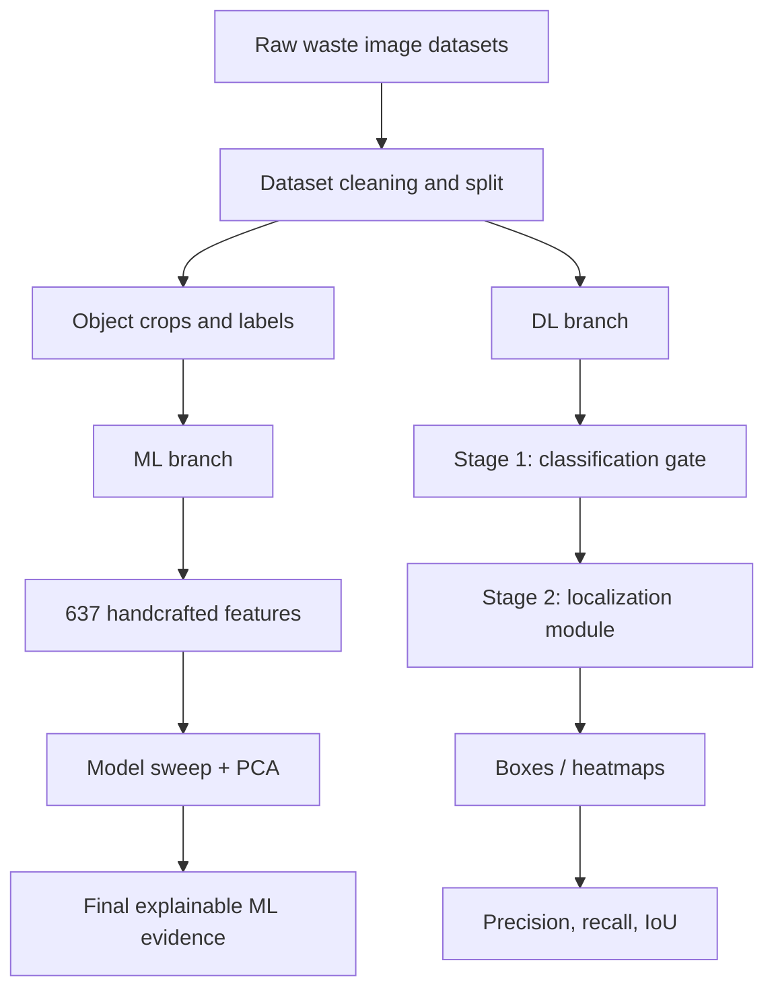

# WasteWise Project Tracker

Created: 2026-05-30

## Dashboard

| Area | Status | Current Focus | Evidence |
|---|---|---|---|
| Repository cleanup | Done | Active folders separated from legacy outputs | `docs/PROJECT_STRUCTURE_AND_CLEANUP.md` |
| GitHub README | Done | Clean project story and commands | `README.md` |
| Pipeline diagrams | Done | ML + current DL + legacy DL diagrams | `docs/PIPELINE_DIAGRAMS.md` |
| ML branch | Keep / final evidence | Explainable classification pipeline | `runs/ml/feature_ml_lecturer_6class_4k` |
| DL branch | Reworked | Classification-first localization | `scripts/classification_to_localization_pipeline.py` |
| Mobile app | Active | React Native / Expo app packaging | `mobile/` |
| Final report | In progress | Tracking report and final positioning | `docs/01_final_report/WasteWise_Project_Tracking_Report.docx` |

## Project Summary

WasteWise is a Final Year Project for automated waste understanding. The current
project story has two branches:

- ML branch: finalized explainable classification using handcrafted features,
  model comparison, and PCA.
- DL branch: redesigned classification-to-localization workflow. Stage 1 is a
  classifier/gate; Stage 2 produces localization evidence using boxes or
  heatmaps.

The old YOLO-first DL pipeline is kept as experiment evidence only.

## Current Architecture



## Active Datasets

| Dataset | Path | Role |
|---|---|---|
| Classification dataset | `data/merged_dataset_v5` | 7-class classification including Background |
| YOLO localization dataset | `external_datasets/super_yolo_dataset` | 6-class localization labels and boxes |

## Key Results

### ML Results

| Model | Accuracy | F1-macro | Status |
|---|---:|---:|---|
| XGBoost | 0.6742 | 0.6506 | Best lecturer-facing ML result |
| ExtraTrees | 0.6312 | 0.6113 | Strong baseline |
| Random Forest | 0.6317 | 0.6111 | Strong baseline |
| Linear SVM | 0.5960 | 0.5642 | Baseline |
| Logistic Regression | 0.5864 | 0.5558 | Baseline |
| Decision Tree | 0.5115 | 0.4883 | Baseline |

### PCA Evidence

| Components | Explained variance | Accuracy | Weighted F1 | Latency |
|---:|---:|---:|---:|---:|
| 637 | 100.00% | 73.24% | 0.7319 | 0.0533 ms |
| 128 | 99.90% | 68.71% | 0.6863 | 0.0314 ms |
| 64 | 99.78% | 67.48% | 0.6736 | 0.0284 ms |

### DL Localization Results

| Stage 2 Localizer | Precision | Recall | Mean matched IoU | TP | FP | FN | Decision |
|---|---:|---:|---:|---:|---:|---:|---|
| Grad-CAM baseline | 0.2568 | 0.0728 | 0.7127 | 19 | 55 | 242 | Weak baseline |
| YOLO localization-only, conf=0.25 | 0.6352 | 0.5670 | 0.9012 | 148 | 85 | 113 | Higher recall |
| YOLO localization-only, conf=0.35 | 0.7614 | 0.5134 | 0.9004 | 134 | 42 | 127 | Recommended quick-check setting |

## Workstreams

### 1. Repository and GitHub

Status: Done

Completed:

- Rewrote GitHub README.
- Added Mermaid pipeline diagrams.
- Pushed latest changes to `origin/main`.
- Removed oversized model binaries from Git tracking.
- Added ignore rules for `*.pth` and `*.onnx`.

Next:

- Update remote URL to moved repository:
  `https://github.com/khoaph0712/Final-Year-Project-PDK.git`
- Decide external storage plan for large model artifacts.

### 2. ML Branch

Status: Keep as final explainable branch

Completed:

- Built 637-feature handcrafted representation.
- Compared classical ML models.
- Ran PCA dimensionality sweep.
- Identified XGBoost as best lecturer-facing ML result.

Next:

- Confirm whether ML metrics need rerun on `data/merged_dataset_v5`.
- Align final report wording with saved artifact paths.
- Add final confusion matrix and feature-importance figures to report.

### 3. DL Branch

Status: Reworked

Completed:

- Moved away from old YOLO-first pipeline as final claim.
- Implemented classification-to-localization script.
- Compared Grad-CAM baseline vs YOLO localization-only stage.
- Selected YOLO localization-only at confidence 0.35 as current quick-check
  recommendation.

Next:

- Expand evaluation beyond 60 stratified images if time allows.
- Add final visual examples to report.
- Decide final wording: classifier gate is internal, localization metrics are
  final DL evaluation.

### 4. Mobile App

Status: Active

Completed:

- React Native / Expo app exists in `mobile/`.
- Package lock refreshed.

Next:

- Confirm final model format for app packaging.
- Keep large binaries outside Git.
- Test app run after model placement.

### 5. Final Report

Status: In progress

Completed:

- Current tracking report exists at:
  `docs/01_final_report/WasteWise_Project_Tracking_Report.docx`
- Legacy report moved to:
  `docs/99_legacy_reports/FINAL_PROJECT_PIPELINE_REPORT_legacy_merged_dataset_v3.md`

Next:

- Use current README + pipeline diagrams as report source.
- Add ML results, PCA result, and DL localization table.
- Avoid presenting old YOLO-first DL pipeline as final workflow.

## Task Board

| Task | Area | Priority | Status |
|---|---|---:|---|
| Update Git remote to moved repository URL | GitHub | High | Todo |
| Choose storage plan for large model binaries | Repo | High | Todo |
| Confirm final ML dataset/version for report | ML | High | Todo |
| Add final ML figures to report | ML | Medium | Todo |
| Run larger DL localization evaluation | DL | Medium | Todo |
| Pick final DL visual examples | DL | Medium | Todo |
| Package mobile model locally | Mobile | Medium | Todo |
| Verify mobile app run | Mobile | Medium | Todo |
| Final report polish | Report | High | Todo |
| Prepare presentation talking points | Report | Medium | Todo |

## Useful Commands

Run current DL localization evaluation:

```powershell
.\.venv311\Scripts\python.exe scripts\classification_to_localization_pipeline.py `
  --max-images 60 `
  --max-visuals 18 `
  --sample-mode stratified `
  --seed 42 `
  --localizer yolo `
  --yolo-conf 0.35 `
  --out-dir runs\dl\localization_rework\yolo_conf035_stratified60_final
```

Regenerate tracking report:

```powershell
.\.venv311\Scripts\python.exe scripts\build_project_tracking_docx.py
```

Preview workspace cleanup:

```powershell
.\scripts\organize_project_workspace.ps1 -WhatIfOnly
```

Run mobile app:

```powershell
cd mobile
npm install
npm run android
```

## Important Links

- GitHub repository moved notice:
  `https://github.com/khoaph0712/Final-Year-Project-PDK.git`
- Local workspace:
  `C:\FYP`
- README:
  `README.md`
- Pipeline diagrams:
  `docs/PIPELINE_DIAGRAMS.md`
- Cleanup notes:
  `docs/PROJECT_STRUCTURE_AND_CLEANUP.md`
- Workflow decision:
  `docs/01_final_report/WORKFLOW_APPROACHES_AND_DL_REWORK.md`

## Decisions

| Date | Decision | Reason |
|---|---|---|
| 2026-05-30 | Keep ML branch as final explainable evidence | Stronger interpretability and completed results |
| 2026-05-30 | Treat old YOLO-first DL pipeline as experiment evidence | Current project direction requires classification-to-localization |
| 2026-05-30 | Use YOLO as Stage 2 localization-only module in DL rework | Better precision and IoU than Grad-CAM baseline |
| 2026-05-30 | Keep large model binaries out of Git | GitHub 100 MB file limit and cleaner repository history |

## Risks

| Risk | Impact | Mitigation |
|---|---|---|
| ML results may be from older dataset version | Report inconsistency | Label clearly or rerun on current dataset |
| Large model artifacts not on GitHub | Reproducibility gap | Store in release, Drive, or local artifact folder |
| DL rework uses YOLO as localizer | Need careful explanation | State YOLO is not final class decision |
| Mobile packaging depends on model format | App demo risk | Choose final lightweight model and test locally |

## Final Report Wording

Use this positioning:

> The ML pipeline is finalized with 637 handcrafted features, classical model
> comparison, and PCA dimensionality reduction. The deep-learning branch is
> redesigned as a classification-to-localization workflow: Stage 1 performs
> image-level classification/gating, and Stage 2 performs localization only.
> The DL branch is therefore evaluated using localization metrics, not final
> classification accuracy.
