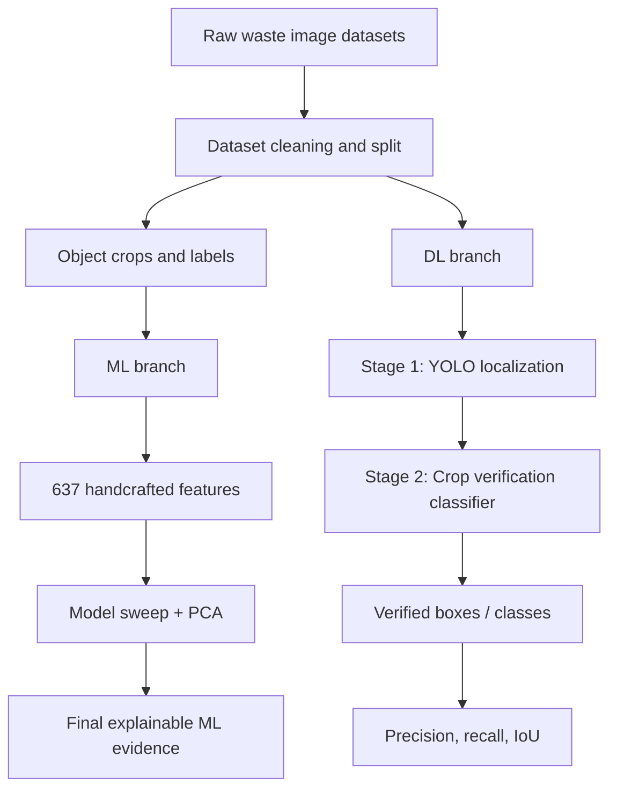

# WasteWise Project Tracker

Created: 2026-05-30

## Dashboard

| Area | Status | Current Focus | Evidence |
|---|---|---|---|
| Repository cleanup | Done | Active folders separated from legacy outputs | `docs/PROJECT_STRUCTURE_AND_CLEANUP.md` |
| GitHub README | Done | Clean project story and commands | `README.md` |
| Pipeline diagrams | Done | ML + current DL + legacy DL diagrams | `docs/PIPELINE_DIAGRAMS.md` |
| ML branch | Keep / final evidence | Explainable classification pipeline | `runs/ml/feature_ml_super_yolo_6class_4k` + legacy lecturer run |
| DL branch | Reworked | Localization-first crop-verification | `scripts/classification_to_localization_pipeline.py` |
| Final report | In progress | Tracking report and final positioning | `docs/01_final_report/WasteWise_Project_Tracking_Report.docx` |

## Project Summary

WasteWise is a Final Year Project for automated waste understanding. The current
project story has two branches:

- ML branch: finalized explainable classification using handcrafted features,
  model comparison, and PCA.
- DL branch: 2-stage hierarchical pipeline. Stage 1 performs object localization (YOLO), and Stage 2 verifies/classifies crops.

The classification-first Grad-CAM DL pipeline is kept as an alternative baseline experiment for comparison.

## Current Architecture


```mermaid
flowchart TD
    A["Raw waste image datasets"] --> B["Dataset cleaning and split"]
    B --> C["Object crops and labels"]
    C --> ML1["ML branch"]
    ML1 --> ML2["637 handcrafted features"]
    ML2 --> ML3["Model sweep + PCA"]
    ML3 --> ML4["Final explainable ML evidence"]
    B --> DL1["DL branch"]
    DL1 --> DL2["Stage 1: YOLO localization"]
    DL2 --> DL3["Stage 2: Crop verification classifier"]
    DL3 --> DL4["Verified boxes / classes"]
    DL4 --> DL5["Precision, recall, IoU"]
```

## Active Datasets

| Dataset | Path | Role |
|---|---|---|
| Classification dataset | `data/merged_dataset_v5` | 7-class classification including Background |
| YOLO localization dataset | `external_datasets/super_yolo_dataset` | 6-class localization labels and boxes |

## Key Results

### ML Results

Newest-dataset rerun on `external_datasets/super_yolo_dataset`:

| Model | Accuracy | F1-macro | Status |
|---|---:|---:|---|
| XGBoost | 0.5408 | 0.3691 | Best current-dataset ML result |
| Random Forest | 0.5063 | 0.3456 | Strong baseline |
| ExtraTrees | 0.5045 | 0.3414 | Strong baseline |
| Linear SVM | 0.4628 | 0.3159 | Baseline |
| Logistic Regression | 0.4494 | 0.3054 | Baseline |
| Decision Tree | 0.3750 | 0.2631 | Baseline |

Legacy lecturer-facing run on `merged_dataset_v3`:

| Model | Accuracy | F1-macro | Status |
|---|---:|---:|---|
| XGBoost | 0.6742 | 0.6506 | Best lecturer-facing ML result |
| ExtraTrees | 0.6312 | 0.6113 | Strong baseline |
| Random Forest | 0.6317 | 0.6111 | Strong baseline |
| Linear SVM | 0.5960 | 0.5642 | Baseline |
| Logistic Regression | 0.5864 | 0.5558 | Baseline |
| Decision Tree | 0.5115 | 0.4883 | Baseline |

### PCA Evidence

Controlled classical-model sweep:

| Model | Components | Explained variance | Accuracy | F1-macro | Drop |
|---|---:|---:|---:|---:|---:|
| Linear SVM | 637 | 100.00% | 62.43% | 0.6235 | 0.00 pp |
| Linear SVM | 128 | 99.90% | 59.90% | 0.5947 | 2.52 pp |
| Logistic Regression | 637 | 100.00% | 60.24% | 0.6019 | 0.00 pp |
| Logistic Regression | 128 | 99.90% | 59.71% | 0.5954 | 0.52 pp |

Legacy ANN-only artifact:

| Components | Explained variance | Accuracy | Weighted F1 | Drop |
|---:|---:|---:|---:|---:|
| 637 | 100.00% | 73.24% | 0.7319 | 0.00 pp |
| 128 | 99.90% | 68.71% | 0.6863 | 4.53 pp |

### DL Localization Results

| Stage 2 Localizer | Precision | Recall | Mean matched IoU | TP | FP | FN | Decision |
|---|---:|---:|---:|---:|---:|---:|---|
| Grad-CAM baseline | 0.2568 | 0.0728 | 0.7127 | 19 | 55 | 242 | Weak baseline |
| YOLO localization-only, conf=0.25 | 0.6352 | 0.5670 | 0.9012 | 148 | 85 | 113 | Higher recall |
| YOLO localization-only, conf=0.30 | 0.6999 | 0.5729 | 0.9057 | 660 | 283 | 492 | Final balanced 300-image setting |
| YOLO localization-only, conf=0.40 | 0.8035 | 0.5148 | 0.9050 | 593 | 145 | 559 | High-precision 300-image setting |

## Workstreams

### 1. Repository and GitHub

Status: Done

Completed:

- Rewrote GitHub README.
- Added Mermaid pipeline diagrams.
- Pushed latest changes to `origin/main`.
- Removed oversized model binaries from Git tracking.
- Added ignore rules for `*.pth` and `*.onnx`.

Next:

- Update remote URL to moved repository:
  `https://github.com/khoaph0712/Final-Year-Project-PDK.git`
- Decide external storage plan for large model artifacts.

### 2. ML Branch

Status: Keep as final explainable branch

Completed:

- Built 637-feature handcrafted representation.
- Compared classical ML models.
- Ran PCA dimensionality sweep.
- Ran controlled PCA model sweep to support the `637 -> 128` about-2% claim.
- Identified XGBoost as best lecturer-facing ML result.
- Reran the 637-feature ML workflow on `external_datasets/super_yolo_dataset`.

Next:

- Keep newest-dataset and legacy ML results separated in the final thesis.
- Explain the newest YOLO test split imbalance when discussing the lower F1.

### 3. DL Branch

Status: Reworked

Completed:

- Moved away from old YOLO-first pipeline as final claim.
- Implemented classification-to-localization script.
- Compared Grad-CAM baseline vs YOLO localization-only stage.
- Selected YOLO localization-only at confidence 0.30 as the final balanced
  300-image recommendation.

Next:

- Expand evaluation beyond 60 stratified images if time allows.
- Add final visual examples to report.
- Decide final wording: classifier gate is internal, localization metrics are
  final DL evaluation.
### 4. Final Report

Status: In progress

Completed:

- Current tracking report exists at:
  `docs/01_final_report/WasteWise_Project_Tracking_Report.docx`
- Legacy report moved to:
  `docs/99_legacy_reports/FINAL_PROJECT_PIPELINE_REPORT_legacy_merged_dataset_v3.md`

Next:

- Use current README + pipeline diagrams as report source.
- Add ML results, PCA result, and DL localization table.
- Avoid presenting old YOLO-first DL pipeline as final workflow.

## Task Board

| Task | Area | Priority | Status |
|---|---|---:|---|
| Update Git remote to moved repository URL | GitHub | High | Todo |
| Choose storage plan for large model binaries | Repo | High | Todo |
| Confirm final ML dataset/version for report | ML | High | Done |
| Add final ML figures to report | ML | Medium | Done |
| Run larger DL localization evaluation | DL | Medium | Done |
| Pick final DL visual examples | DL | Medium | Done |
| Final report polish | Report | High | In progress |
| Prepare presentation talking points | Report | Medium | Todo |

## Useful Commands

Run current DL localization evaluation:

```powershell
.\.venv311\Scripts\python.exe scripts\classification_to_localization_pipeline.py `
  --max-images 300 `
  --max-visuals 24 `
  --sample-mode stratified `
  --seed 42 `
  --localizer yolo `
  --yolo-conf 0.30 `
  --out-dir runs\dl\localization_rework\yolo_conf030_stratified300_final
```

Regenerate tracking report:

```powershell
.\.venv311\Scripts\python.exe scripts\build_project_tracking_docx.py
```

Preview workspace cleanup:

```powershell
.\scripts\organize_project_workspace.ps1 -WhatIfOnly
```
## Important Links

- GitHub repository moved notice:
  `https://github.com/khoaph0712/Final-Year-Project-PDK.git`
- Local workspace:
  `C:\FYP`
- README:
  `README.md`
- Pipeline diagrams:
  `docs/PIPELINE_DIAGRAMS.md`
- Cleanup notes:
  `docs/PROJECT_STRUCTURE_AND_CLEANUP.md`
- Workflow decision:
  `docs/01_final_report/WORKFLOW_APPROACHES_AND_DL_REWORK.md`

## Decisions

| Date | Decision | Reason |
|---|---|---|
| 2026-05-30 | Keep ML branch as final explainable evidence | Stronger interpretability and completed results |
| 2026-05-30 | Treat old YOLO-first DL pipeline as experiment evidence | Current project direction requires classification-to-localization |
| 2026-05-30 | Use YOLO as Stage 2 localization-only module in DL rework | Better precision and IoU than Grad-CAM baseline |
| 2026-05-30 | Keep large model binaries out of Git | GitHub 100 MB file limit and cleaner repository history |

## Risks

| Risk | Impact | Mitigation |
|---|---|---|
| ML results may be from older dataset version | Report inconsistency | Label clearly or rerun on current dataset |
| Large model artifacts not on GitHub | Reproducibility gap | Store in release, Drive, or local artifact folder |
| DL rework uses YOLO as localizer | Need careful explanation | State YOLO is not final class decision |

## Final Report Wording

Use this positioning:

> The ML pipeline is finalized with 637 handcrafted features, classical model
> comparison, and PCA dimensionality reduction. The deep-learning branch is
> implemented as a 2-stage hierarchical pipeline: Stage 1 performs object
> localization (YOLO), and Stage 2 performs crop classification verification.
> This matches the production system's logic of running localization first, then classification.
