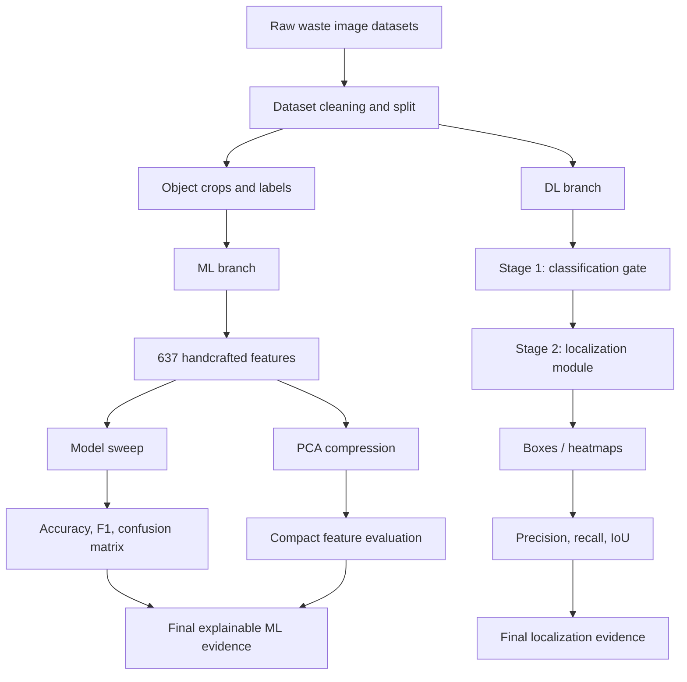
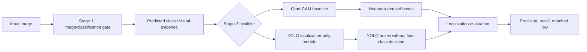
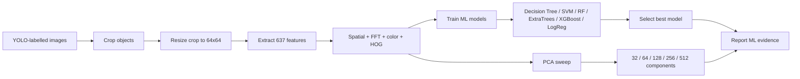
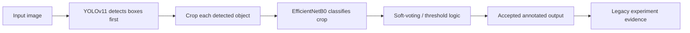
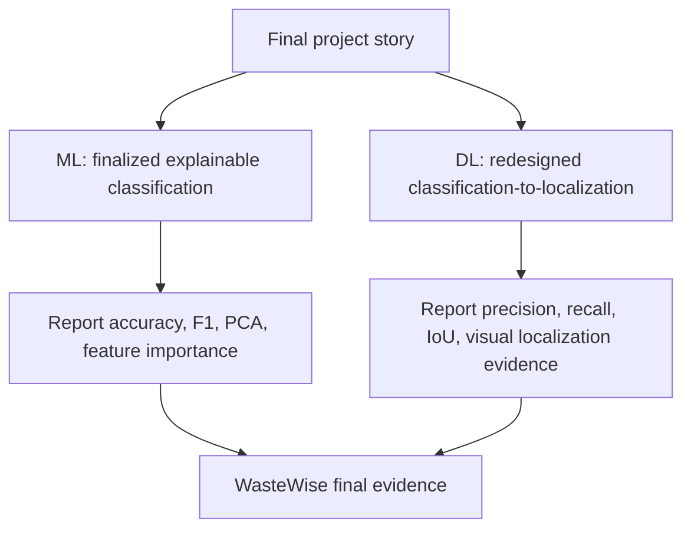

# WasteWise Pipeline Diagrams

These diagrams match the current project positioning: the ML branch stays as the
explainable finalized pipeline, while the DL branch is presented as a
classification-to-localization workflow.

## Overall Project Workflow

## Current DL Pipeline

## Classical ML Pipeline

## Legacy DL Pipeline

## Final Report Positioning

