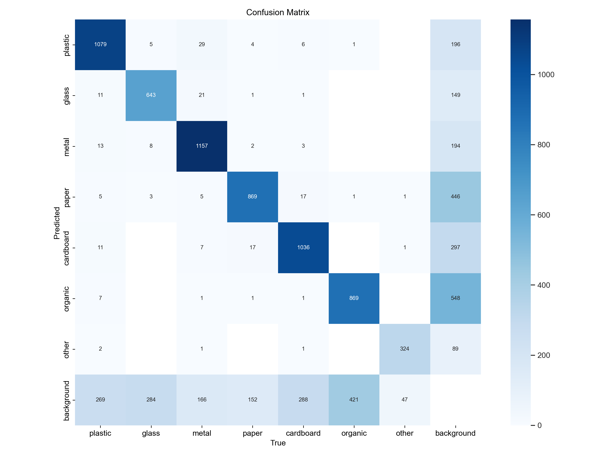
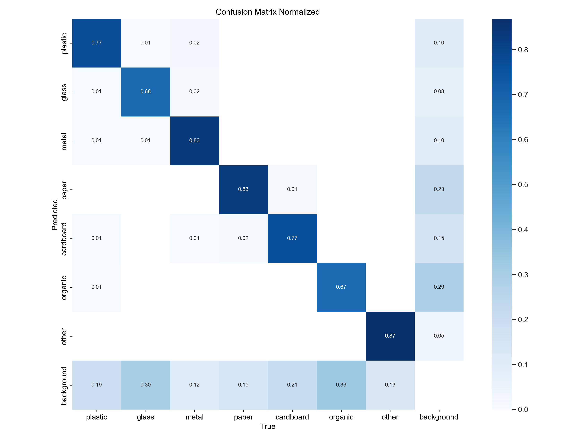
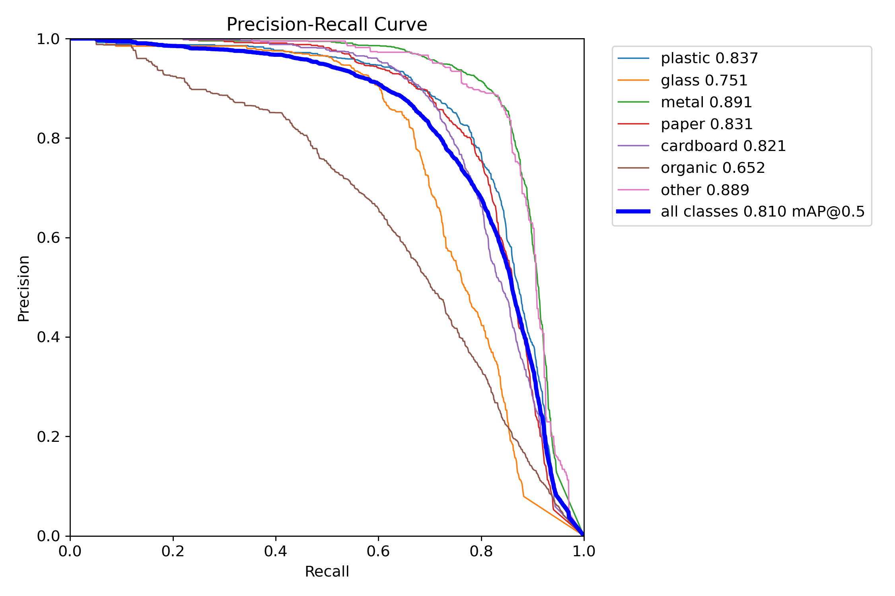
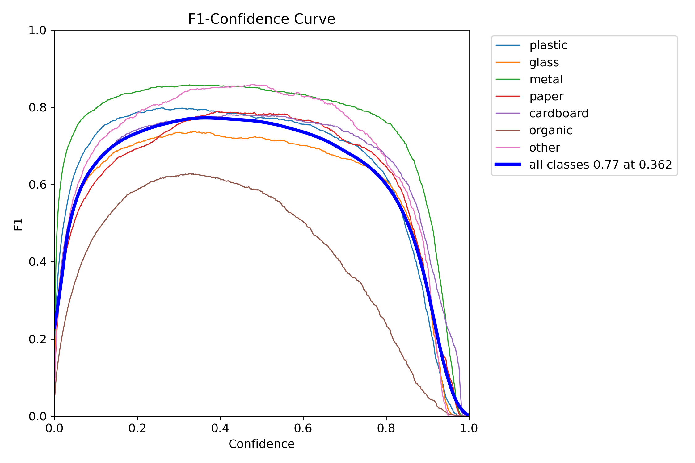
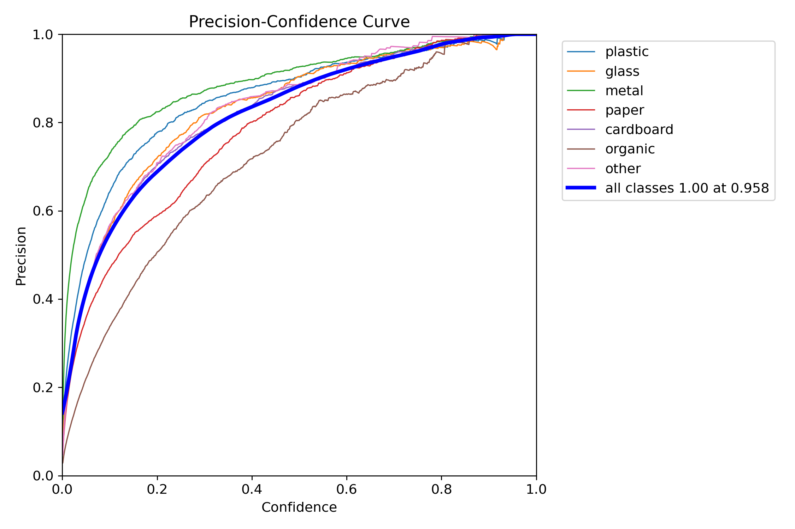
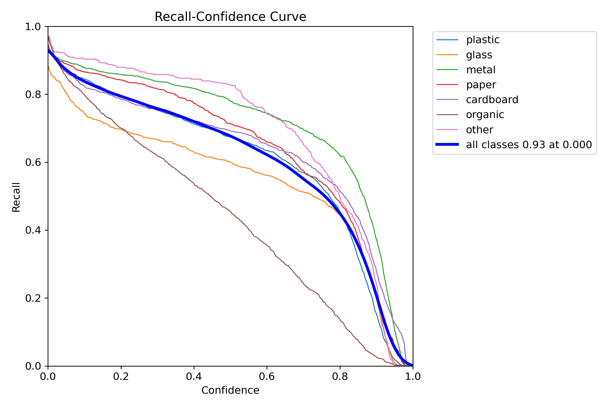

# YOLOv8n Waste Sorting — Quality Report

- **Weights:** `runs\dl\trash_yolov8n_realworld_focus_v3\weights\best.pt`
- **Dataset:** `tuned_dataset_v3_realworld_focus\data.yaml`
- **Image size:** 640

## Overall — `val` split

| Metric | Value |
|---|---|
| Precision | 0.8221 |
| Recall | 0.7321 |
| mAP@0.5 | 0.8103 |
| mAP@0.5:0.95 | 0.6073 |
| Fitness | 0.6276 |

### Per-class

| Class | P | R | F1 | AP@0.5 | AP@0.5:0.95 |
|---|---|---|---|---|---|
| metal | 0.8921 | 0.8227 | 0.8560 | 0.8909 | 0.7461 |
| cardboard | 0.8254 | 0.7317 | 0.7758 | 0.8211 | 0.6648 |
| other | 0.8502 | 0.8472 | 0.8487 | 0.8885 | 0.6417 |
| paper | 0.7747 | 0.7887 | 0.7816 | 0.8314 | 0.6340 |
| plastic | 0.8695 | 0.7266 | 0.7916 | 0.8371 | 0.6327 |
| glass | 0.8506 | 0.6458 | 0.7342 | 0.7507 | 0.5521 |
| organic | 0.6923 | 0.5619 | 0.6203 | 0.6524 | 0.3798 |

**Speed (ms/image):** preprocess `1.65` · inference `6.82` · postprocess `2.36`

## Overall — `test` split

| Metric | Value |
|---|---|
| Precision | 0.8382 |
| Recall | 0.7113 |
| mAP@0.5 | 0.7999 |
| mAP@0.5:0.95 | 0.6076 |
| Fitness | 0.6268 |

### Per-class

| Class | P | R | F1 | AP@0.5 | AP@0.5:0.95 |
|---|---|---|---|---|---|
| plastic | 0.8984 | 0.8051 | 0.8492 | 0.8880 | 0.6969 |
| metal | 0.8847 | 0.7392 | 0.8054 | 0.8184 | 0.6715 |
| glass | 0.9018 | 0.7275 | 0.8053 | 0.8209 | 0.6430 |
| cardboard | 0.8218 | 0.7015 | 0.7569 | 0.7869 | 0.6342 |
| paper | 0.7831 | 0.7212 | 0.7509 | 0.8022 | 0.6274 |
| other | 0.8601 | 0.7897 | 0.8234 | 0.8613 | 0.6159 |
| organic | 0.7175 | 0.4950 | 0.5858 | 0.6218 | 0.3640 |

**Speed (ms/image):** preprocess `1.00` · inference `3.56` · postprocess `1.15`

## Plots

### Confusion matrix

### Confusion matrix (normalized)

### Precision-Recall curve

### F1 vs. confidence

### Precision vs. confidence

### Recall vs. confidence

## Sample predictions

See the `predictions/` folder for annotated images.

## Interpretation hints

- If `mAP@0.5:0.95` < 0.4 on test: consider more epochs, `imgsz=800`, or class balancing.
- If a single class has very low AP: check dataset balance and label quality for it.
- If recall is much lower than precision: lower inference `conf` threshold in the app, or add more training data for hard-to-detect classes.
- If the confusion matrix shows `plastic ↔ glass` bleed: these look alike in photos; consider a second-stage classifier or adding contextual cues.
