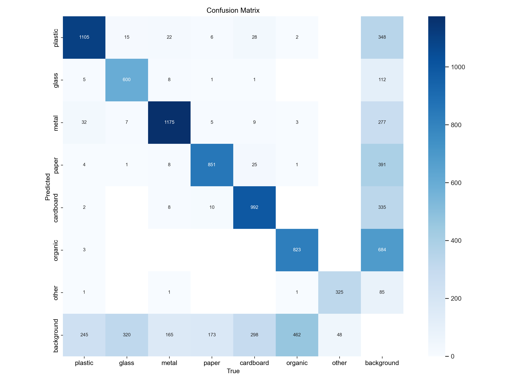
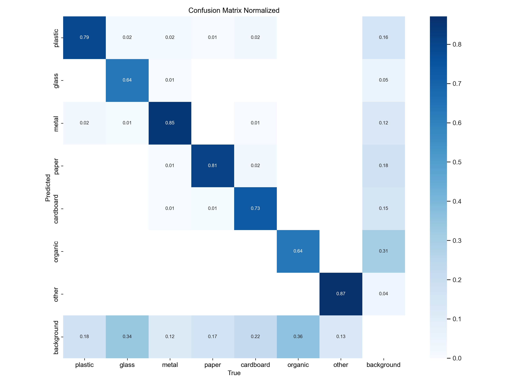
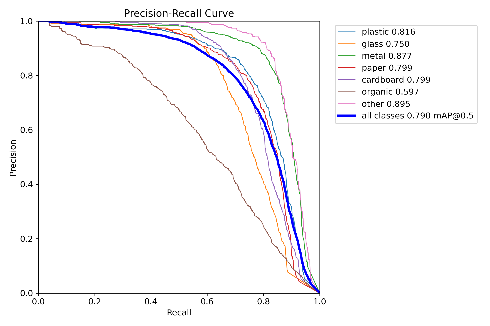
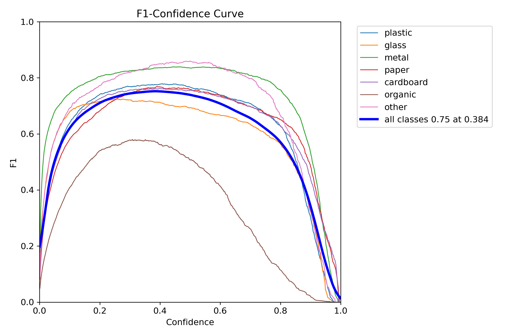
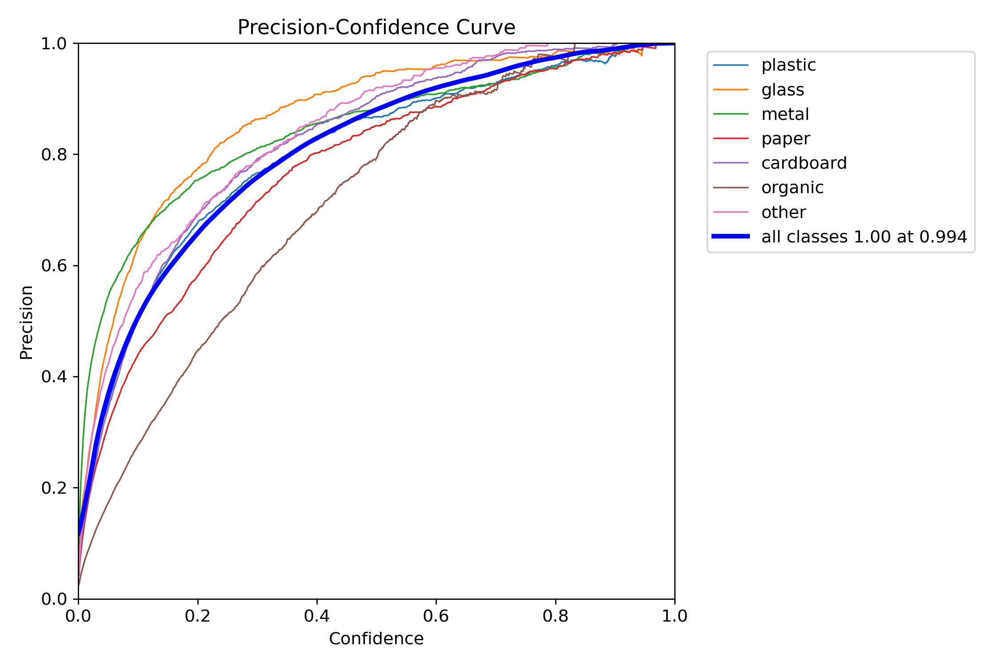
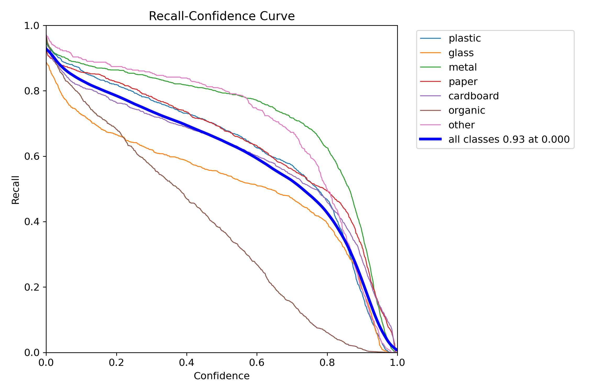

# YOLOv8n Waste Sorting — Quality Report

- **Weights:** `runs\dl\trash_yolov8n_realworld_v2\weights\best.pt`
- **Dataset:** `tuned_dataset_v2_realworld\data.yaml`
- **Image size:** 640

## Overall — `val` split

| Metric | Value |
|---|---|
| Precision | 0.8230 |
| Recall | 0.7003 |
| mAP@0.5 | 0.7904 |
| mAP@0.5:0.95 | 0.5860 |
| Fitness | 0.6064 |

### Per-class

| Class | P | R | F1 | AP@0.5 | AP@0.5:0.95 |
|---|---|---|---|---|---|
| metal | 0.8524 | 0.8190 | 0.8354 | 0.8769 | 0.7281 |
| other | 0.8557 | 0.8391 | 0.8474 | 0.8945 | 0.6367 |
| cardboard | 0.8447 | 0.6917 | 0.7606 | 0.7988 | 0.6361 |
| paper | 0.7976 | 0.7409 | 0.7682 | 0.7992 | 0.6129 |
| plastic | 0.8231 | 0.7329 | 0.7754 | 0.8156 | 0.6110 |
| glass | 0.9013 | 0.5905 | 0.7135 | 0.7503 | 0.5402 |
| organic | 0.6863 | 0.4876 | 0.5702 | 0.5972 | 0.3371 |

**Speed (ms/image):** preprocess `0.89` · inference `2.36` · postprocess `0.61`

## Overall — `test` split

| Metric | Value |
|---|---|
| Precision | 0.8119 |
| Recall | 0.6945 |
| mAP@0.5 | 0.7767 |
| mAP@0.5:0.95 | 0.5837 |
| Fitness | 0.6030 |

### Per-class

| Class | P | R | F1 | AP@0.5 | AP@0.5:0.95 |
|---|---|---|---|---|---|
| plastic | 0.8163 | 0.8229 | 0.8196 | 0.8692 | 0.6812 |
| metal | 0.8607 | 0.7400 | 0.7958 | 0.8035 | 0.6582 |
| glass | 0.9018 | 0.6877 | 0.7803 | 0.8174 | 0.6227 |
| paper | 0.7737 | 0.7030 | 0.7366 | 0.7686 | 0.6119 |
| cardboard | 0.8277 | 0.6715 | 0.7415 | 0.7532 | 0.5992 |
| other | 0.8640 | 0.7922 | 0.8265 | 0.8640 | 0.5950 |
| organic | 0.6391 | 0.4438 | 0.5239 | 0.5612 | 0.3177 |

**Speed (ms/image):** preprocess `0.89` · inference `2.32` · postprocess `0.59`

## Plots

### Confusion matrix

### Confusion matrix (normalized)

### Precision-Recall curve

### F1 vs. confidence

### Precision vs. confidence

### Recall vs. confidence

## Sample predictions

See the `predictions/` folder for annotated images.

## Interpretation hints

- If `mAP@0.5:0.95` < 0.4 on test: consider more epochs, `imgsz=800`, or class balancing.
- If a single class has very low AP: check dataset balance and label quality for it.
- If recall is much lower than precision: lower inference `conf` threshold in the app, or add more training data for hard-to-detect classes.
- If the confusion matrix shows `plastic ↔ glass` bleed: these look alike in photos; consider a second-stage classifier or adding contextual cues.
